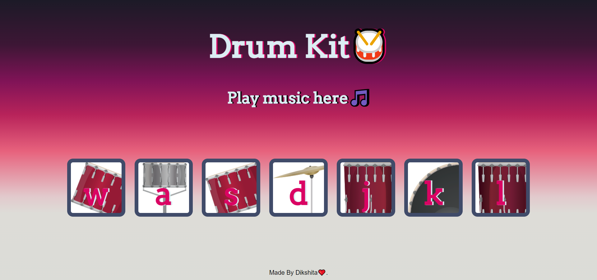

<h1>Drum Kit 🥁</h1>

In this simple website of Drum kit, there are 7 buttons and whenever you click on any button
 or press mentioned key, then it will produces sound.🎼

<h4>Languages Used</h4>
<ul>
    <li>HTML</li>
    <li>CSS</li>
    <li>Javascript</li>
</ul>

 

